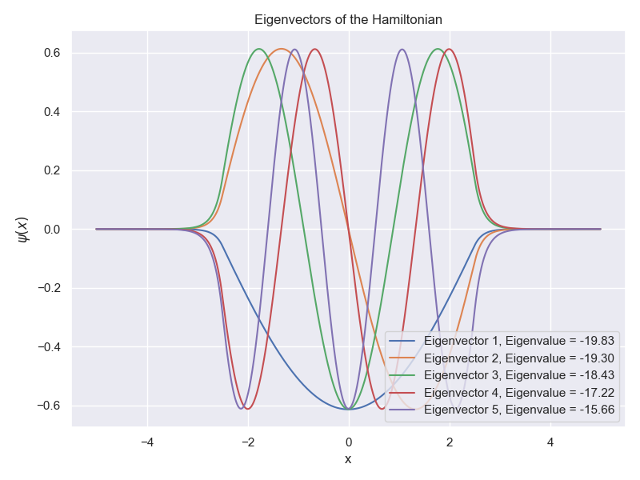
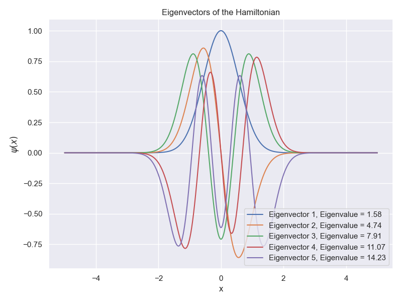

# Quantum Wavefunction Evolution Simulation

## Overview
This project simulates the time evolution of a quantum particle in a one-dimensional system, governed by the Hamiltonian:

$$\hat H = \frac{\hat p^2}{2m} + V(x)$$

Where:
- `x` is the particle's position.
- `p` is the particle's momentum.
- `m` is the particle's mass.
- `V(x)` is the potential energy function.

The project visualizes the quantum wavefunction's time evolution for different energy eigenstates $\psi_n(x, t)$ using the **time-dependent Schrödinger equation**, implemented in a Jupyter Notebook (`main.ipynb`).

## Mathematical Background

### Schrödinger Equation
The time-dependent Schrödinger equation is:
    
$$ i\hbar \frac{\partial \psi}{\partial t} = H \psi(x, t) $$

Substituting $\hat H = \frac{\hat{p}^2}{2m} + V(x)$ and using the canonical momentum operator $\hat{p} = -i\hbar \frac{\partial}{\partial x}$:

$$
i\hbar \frac{\partial \psi(x, t)}{\partial t} = \left[-\frac{\hbar^2}{2m} \frac{\partial^2}{\partial x^2} + V(x)\right] \psi(x, t).
$$

For a stationary potential $V(x)$, the time evolution is determined by the eigenstates of the Hamiltonian. Solving the **time-independent Schrödinger equation**:

$$
\hat H | \psi_n(x) \rangle = E_n | \psi_n(x) \rangle
$$

yields energy eigenvalues $E_n$ and eigenfunctions $ \psi_n(x) $.  A general wavefunction is expressed as:
    
$$
\psi(x, t) = \sum_n c_n \psi_n(x) e^{-iE_n t / \hbar}
$$

where $c_n$ are the coefficients for the eigenstate decomposition.

### Time Evolution
By selecting specific energy eigenstates or superpositions of eigenstates $\psi(x, t) = \sum_n c_n \psi_n(x) $, we utilize their time-dependent factor $ e^{-iE_n t / \hbar} $ to study the wavefunction's evolution over time.

## Project Structure

### Features
1. **Hamiltonian Simulation**:
    - Solve the time-independent Schrödinger equation to compute $\psi_n(x)$ and $E_n$.
2. **Wavefunction Time Evolution**:
    - Visualize the evolution of the probability density $|\psi(x, t)|^2 $.
3. **Potential Use Cases**:
    - Simple potentials $V(x)$: e.g. free particle, infinite square well, harmonic oscillator.
    - Customizable user-defined potentials.

### Implemented Methods

The `main.ipynb` notebook includes functions for:

- Defining spatial grids (`define_grid`).
- Defining various potentials (`potential_square_well`, `potential_harmonic_oscillator`, `potential_free_particle`, `potential_custom`).
- Defining initial wave packets (`gaussian_wave`, `square_wave`, `triangular_wave`, `custom_wave`).
- Constructing the Hamiltonian matrix (`construct_hamiltonian`).
- Solving the time-independent Schrödinger equation (`solve_schrodinger`).
- Compute the coefficients of the initial wavefunction (`get_coefficients`)
- Computing the time-evolved wavefunction (`wavefunction_evolution`).
- Calculating the expectation value of position (`calculate_expectation_value`).
- Animating the wavefunction evolution (`animate_wavefunction`).
- Plot the initial conditions of the system (`plot_starting_conditions`)

### Visualizations
The simulation generates dynamic visualizations showcasing:
1. The initial wavefunction and defined potential.
2. The system's evolution over time.
3. Comparisons between different energy eigenstates.

## Usage Instructions
1. Clone this repository into your working directory.
2. Install required dependencies using:
   ```bash
   pip install -r requirements.txt
   ```
3. Open and run the `main.ipynb` Jupyter Notebook.
4. Modify parameters within the notebook to explore different potentials, initial wavefunctions, and simulation settings.

### Dependencies
The simulation uses the following Python libraries:
- **numpy**: Efficient numerical routines.
- **scipy**: Solving eigenvalue problems.
- **matplotlib**: Wavefunction and probability density visualization.
- **ffmpeg**: Creating animations for wavefunction evolution.
- **seaborn**: Aesthetic visualizations.

## Demo Examples

The following examples demonstrate the capabilities of the simulation:

### Infinite Square Well

This example shows the evolution of a Gaussian wave packet in a finite square-well potential:



[Square well](Examples/wavefunction_harmonic_square.mp4)

### Harmonic Oscillator

Time evolution of a square wave in a harmonic oscillator potential:



[Harmonic Oscillator](Examples/wavefunction_harmonic_square.mp4)

### Wave Packet Evolution

Complete animation of quantum wave packet in a custom potential:

[Wavefunction Evolution Video](wavefunction.mp4)
